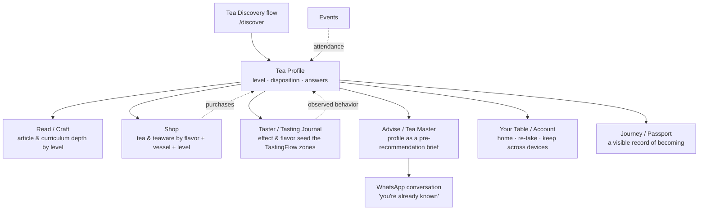

# Tea Discovery — onboarding profile & integration schema

> **Status:** Phase 1 (the flow + local profile + Your Table surfacing) shipped. Phase 2 (server
> persistence, tea-master visibility, recommendation matching) designed here, not yet built.
>
> **Code:** `src/pages/DiscoverPage.tsx`, `src/components/TeaDiscovery/*`, route `/discover`.
> **State:** `teaDiscoveryProfile` in `src/lib/store.ts` (persisted to `teajia-storage`).
> **Your Table:** a `discover` tile in `AccountPanel/LaunchpadView.tsx` shows the member's
> disposition (or "find your tea"); signed-out guests get a "Discover your tea" link via
> `READER_EXPLORE_LINKS` in `AccountPanel/workflows.ts`.

## What it is
A mobile-first, screen-by-screen question flow that helps people *discover the way they drink tea for
themselves*, then hands back a **Tea Profile**: an experience `level`, a named **disposition** (the
mirror), and the raw answers. It is the front door for newcomers and the connective tissue between
every surface of Teajia.

It is **not** an analytics grab. The output is a *gift, not a form* — see "Value exchange" below.

## The five questions
One decision per screen, ~5 taps. Config lives in `src/components/TeaDiscovery/questions.ts`.

| # | Question | id | Shape | Powers |
|---|---|---|---|---|
| 1 | Where are you with tea right now? | `experience` | single, text | `level` (curious / practicing / devoted) → content depth |
| 2 | How do you like to brew? | `brew` | single, **picture + tap-to-learn** | vessel literacy; teaware recs; the education layer |
| 3 | What flavors pull you in? | `flavor` | single, **color swatch** | tea-family recs |
| 4 | How do you like to take your tea? | `temperament` | single, text | disposition; session/event fit |
| 5 | What does tea give you? | `motivation` | **multi**, text | disposition; maps to the taster "Effect" zone |

Brewing options ladder from familiar to advanced — mug & teabag, bowl (grandpa style), teapot,
gaiwan, Yixing clay — each with a non-blocking **"What's this?"** explainer. The Yixing copy gently
corrects the common misconception (people own one without knowing what it's for).

## Disposition (the mirror)
`deriveDisposition(answers)` (`src/components/TeaDiscovery/dispositions.ts`) resolves a named
disposition from temperament ⨯ motivation, nuanced by experience. Current set: **The Quiet Steeper ·
The Host · The Flavor Seeker · The Daily Drinker · The Curious Beginner · The Deep Diver**. These are
mirrors, not horoscopes — every line is traceable to the answers that produce it.

## Integration schema

### Field-by-field map
| Profile field | Read/Craft | Shop | Taster | Tea master |
|---|---|---|---|---|
| `level` | curriculum module / article depth | starter vs advanced teas | `simplified` TastingFlow for beginners | how much to explain |
| `answers.flavor` | flavor-origin articles | tea family filter | pre-highlight flavor families | what to pour first |
| `answers.brew` | brewing lessons | teaware (gaiwan, Yixing…) | default vessel | gear-readiness |
| `answers.motivation` (effect) | "why tea" pieces | mood-led collections | seeds the "Effect" zone | the *why* behind a recommendation |
| `disposition` | tone of voice | curated set framing | — | the human read at a glance |

## Value exchange & psychology
The reason people will *want* to fill this out — and feel served, not mined:

1. **Immediate self-insight.** The disposition mirror is the reward, delivered the instant they
   finish. It's about them, not us. (Why people share personality-quiz results and never share
   surveys.)
2. **Education *during* the flow.** The tap-to-learn layer means even answering gives something back
   — value on every screen, not gated behind the result.
3. **Belonging.** Naming a disposition places someone in a living tradition (a bowl-drinker, a
   grandpa-style person), which beats points and badges.
4. **Attunement, not analytics.** The honest stance, said plainly in the UI: *"We don't use this to
   sell you more. We use it so the right tea finds you — and so when you message us, you're already
   known."* This is the opposite of retargeting: a mass retailer profiles you to chase you with ads;
   a tea master remembers you drink for stillness and reach for a gaiwan.

**No gamification** (honors `CLAUDE.md`'s DO NOT list — no streaks/points/badges).

## Evolution path
The profile is a *living document*, and the "upgrade" is **deepening attunement earned through
practice**, never tiers:

- **Stated preference** (the quiz) → **observed behavior** (Tasting Journal entries, purchases, event
  attendance) → a **truer, self-correcting profile**.
- That growth is made visible through the existing **Journey / Passport** surfaces
  (`/account/journey`, `/passport/:token`) — a record of becoming, not a leaderboard.
- The incentive to keep it current is the same as keeping a journal: to witness your own palate
  change. Sharper recommendations and a tea master who knows you better follow naturally.

The Phase 1 results screen plants this seed (a single line linking to the tasting journal); the full
loop is Phase 2.

## Phase 2 (designed, not built)
1. **Server persistence.** New D1 migration + a Worker route in `worker/src/index.ts`, account-scoped
   via the `X-Teajia-Account` header, tying the profile to a signed-in customer. The v1 client writes
   through `setTeaDiscoveryProfile`, so this slots in behind the same setter.
2. **Tea-master visibility.** Surface the profile in admin/consult and via the `find_customer` MCP
   tool (`worker/src/mcp.ts`) — the brief a tea master reads before the WhatsApp conversation.
3. **Recommendation matching.** Turn `level` + `flavor` + `brew` + `motivation` into concrete article,
   tea, and teaware recommendations (replacing the v1 generic next-step links).
4. **Evolution loop.** Refresh the profile from tasting/purchase/event signals; reflect drift in the
   Journey/Passport.
5. **Real photography.** `DiscoveryOption.image` is a reserved slot — drop vessel photos in to replace
   the line illustrations with no schema change.
